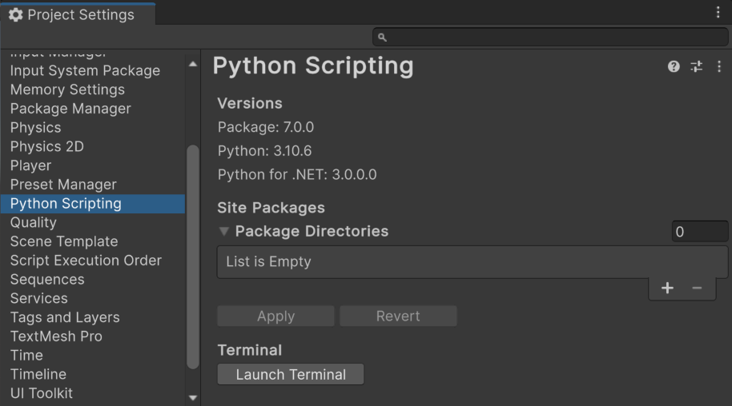

# Python Scripting Settings

You can find preferences for Python Scripting in the Project Settings under the
Edit menu.



The top of the window is useful information when looking for help to explain
exactly which version of the various components you are using.

## Component Versions

Python Scripting bundles with it a copy of the CPython implementation for Python
along with a custom build of Python for .NET. For information purposes the
Settings panel verifies which version of each is in fact installed. They cannot
be changed.

## Site Packages

You can add site-packages that will be added to the `sys.path` to find
additional Python modules. Changes are only applied after you restart Unity.


<a name="pipPackages"></a>

## Pip Packages

You can install Python packages using pip for your project. They will be installed
inside the `Library/PythonInstall/Lib/site-packages` folder of the project.

### Installing packages with a requirements file

You can store your required Python packages with their versions in a `requirements.txt`
file.

If you want to share your Unity project with someone else or you are working in a
team, sharing the `requirements.txt` file will ensure everyone is using the same
versions of the same packages. Simply opening a project with a `requirements.txt` file
will automatically install any missing packages, and uninstall unused ones.

Place the requirements file in `ProjectSettings/requirements.txt` in your Unity project
for the Python Scripting package to find it.

For details on creating a requirements file and its uses, please refer to the [pip documentation](https://pip.pypa.io/en/stable/user_guide/#requirements-files).

Unity will only apply the `requirements.txt` when you open a project.
If you change the `requirements.txt` while you have a project open (for example, if you update your project from revision control while Unity is running),
the Python packages will not update. To apply the new requirements you will need to restart Unity.

### Installing packages on the command-line (Windows)

Click on the `Spawn shell in environment` button which is available in the
settings panel on Windows. A PowerShell window will open, with its PATH environment
variable pointing to the Unity Python installation. 

Use `pip3` to manage your local packages:

```
PS D:\UnityProjects\Python 3> pip3 install numpy
Collecting numpy
  Downloading numpy-1.21.2-cp37-cp37m-macosx_10_9_x86_64.whl (16.9 MB)
     |████████████████████████████████| 16.9 MB 3.5 MB/s
Installing collected packages: numpy
Successfully installed numpy-1.21.2
```

After making changes to the Python packages, make sure to update the
`ProjectSettings/requirements.txt` file. Otherwise your changes will be
reverted next time you reopen the project. You can use this command for example:
```
pip3 freeze > ProjectSettings/requirements.txt
```

### Installing packages on the command-line (macOS)

In the Project window, right-click on Assets and select Reveal in Finder.
Open a macOS Terminal window and type `cd `. Now drag the `Library` folder from Finder
to the Terminal window and press **Enter**. Next, type `cd PythonInstall/bin` 
and press **Enter**. Your Terminal window should look something like this:
```
$ cd /Users/myusername/My\ Unity\ Project/Library
$ cd PythonInstall/bin
```

Use `./pip3` to manage your local packages:

```
$ ./pip3 install numpy
Collecting numpy
  Downloading numpy-1.21.2-cp37-cp37m-macosx_10_9_x86_64.whl (16.9 MB)
     |████████████████████████████████| 16.9 MB 3.5 MB/s
Installing collected packages: numpy
Successfully installed numpy-1.21.2
```

After making changes to the Python packages, make sure to update the
`ProjectSettings/requirements.txt` file. Otherwise your changes will be
reverted next time you reopen the project. You can use this command for example:
```
./pip3 freeze > ../../../ProjectSettings/requirements.txt
```

## Limitations

* You cannot change the internal Python version nor use a virtual environment manager like `venv` or `conda`.
* Paths are treated as verbatim strings. You will need to expand environment
  variables or (on macOS and linux) the `~` denoting the home directory.
