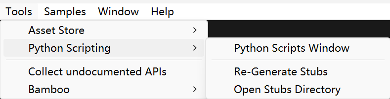
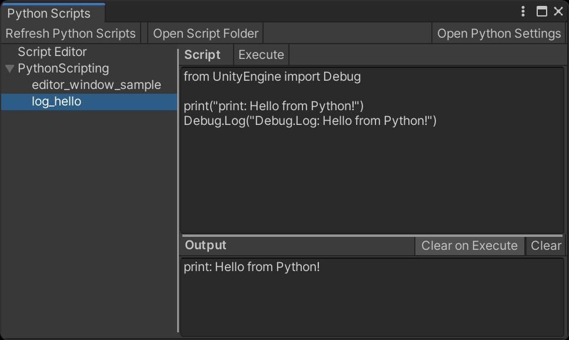
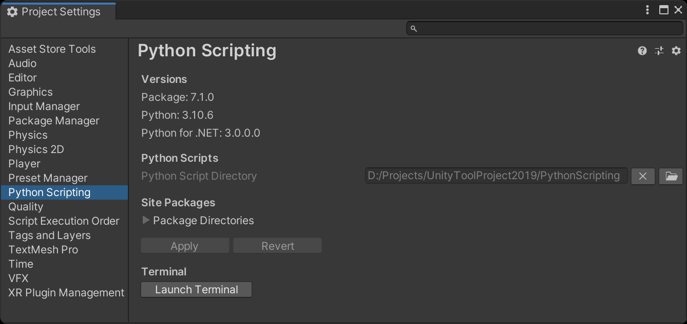

> Python Scripting is an integration of the open-source Python for .NET project. This package provides the means to import the Python Runtime Environment as a namespace and execute Python scripts from the Unity Editor. 

This package is based on Unity's official [com.unity.scripting.python](https://docs.unity3d.com/Packages/com.unity.scripting.python@7.0/manual/index.html) package with the following modifications:

> **⚠ Warning**: These modifications have not been fully tested. Use at your own risk.

### Added

  - **Menu Item** `Tools/Python Scripting/Re-Generate Stubs`: Generates Python stub files for IDE autocompletion.
  - **Menu Item** `Tools/Python Scripting/Open Stubs Directory`: Opens the generated stubs directory in the file explorer.
  - **`PythonEditorWindow` Class**: Allows the creation of custom Editor Windows using Python scripts.
  - **Python Script Directory Setting**: Added a **Python Script Directory** field in `PythonSettings` to specify the directory for your project's Python scripts.
  - **Python Scripts Window**:
      - Quickly browse and execute scripts from the specified **Python Script Directory**.
      - Edit and run temporary scripts on the fly.
      - This window replaces the original **Python Script Editor** window.
  - **Menu Item** `Tools/Python Scripting/Python Scripts Window`: Opens the **Python Scripts** window.
  - **Python Editor Window Sample**: Provides a sample demonstrating how to create an Editor Window using Python code.
      - The sample can be imported from the Python Scripting package in the Package Manager window.

### Changed

  - **Delayed Initialization**: Python initialization is deferred until its first use, speeding up editor reload times after C# script compilation.
  - **Version Compatibility**: Lowered the minimum required Unity version to 2019.4.
  - **Output Redirection**: Changed the redirection target of Python's `sys.stdout` from `PythonConsoleWindow.AddToOutput` to `PythonStdoutBroadcaster.BroadcastPythonStdout`. 

## Screenshots

### Menu Items

### Python Scripts Window

### Python Settings

